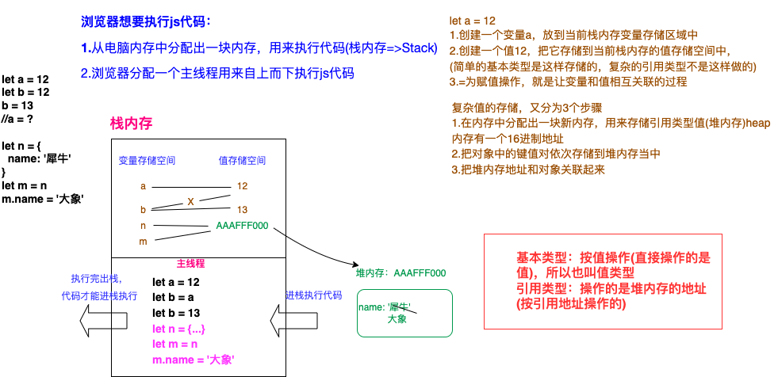

### 浏览器
> QQ、谷歌、百度、360、UC、Safari、Opera、IE(Edge)>、搜狗、猎豹-金山、好123...
> 360抢票崛起
> 猎豹也是

### 内核
- webkit内核(`V8引擎`)
    + Chrome
    + Safari
    + Opera >= 14
    + ...
- Gecko
    + Firefox
- Presto
    + Opera < 14
- Trident
    + IE
    + IE EDGE开始采用双内核(迷你chrome)

### 变量
- var
- const
- let
- function fn() {}
    > 创建函数也相当于在创建变量
- class A {}
    > 创建类也相当于创建变量
- import B from './B,js'
    > es6的导入模块也可以创建变量
### 变量的命名规范
- 严格区分大小写
- 使用数字、字母、下划线、美元符号(数字不能开头)
- 使用驼峰命名
- 不能使用关键字和保留字
> 当下有特殊含义的是关键字，未来可能会成为关键字的叫做保留字
> var let const function...

### js中常用数据类型
- 基本数据类型
    - 数字 number
        > 常规数字、NaN
        >
        > NaN和任何值都不相等
        >
        > NaN == NaN //false
        >
        > isNaN - 检测一个值是否是非有效数字，如果不是有效数据返回true 

#### isNaN

```js
//isNaN([val]) 参数描述占位符
isNaN(10) // false
isNaN('a') // true
/*
1.Number('a') => NaN
2.isNaN(NaN) => true
*/
isNaN('10') // false
/*
1.Number('10') => 10
2.isNaN(10) => false
*/
```

`isNaN底层检测机制：首先会把检测的对象转化为数字类型(基于Number这个方法把值转化为数字类型)`

#### 其他类型转化为数字类型

##### Number([val])

`浏览器底层机制进行判断`

```js
// 1.字符串转化为数字-(只要字符串中包含任意一个非有效数字字符(第一个点除外)，结果都是NaN,空字符串会变成数字0)
Number('11.1') // 11.1
Number('11.1px') // NaN
Number('11.1.9') // NaN
Number('') // 0
// 2.布尔转为数字
Number(true) // 1
Number(false) // 0
// 3.null
Number(null) // 0
// 4.undefined
Number(undefined) // NaN
// 5.引用类型转化为数字-是先把他基于toString方法转化为字符串，然后再转化为数字
Number({}) // NaN
/*
1.({}).toString() => '[object Object]'
2.字符串转化为数字 Number('[object Object]') => NaN
*/
Number({name:'xxx'}) // NaN
Number([]) // 0
Number([12]) // 12
Number([12, 34]) // NaN
/*
1.[12,34].toString() => '12,34'
2.Number('12,34') => NaN
*/
```

##### parseInt/parseFloat([val], [进制])

`浏览器引擎额外提供的方法`

也是转换为数字的方法，对于字符串来说，他是从左到右依次查找有效数字字符，直到遇到非有效数字字符，就不再查找，把找到的当做数字返回

```js
parseInt('12.5px') // 12
parseFloat('12.5px') // 12.5
parseInt('width: 12px;') // NaN
```

##### ==比较

可能会把其他类型的值转换为数字

- 字符串 string

#### 其他类型转化为字符串

##### [val].toString()

```js
(null).toString() // 报错
(undefined).toString() // 报错

(11).toString() // '11'
(NaN).toString() // 'NaN'
(/^$/).toString() // '/^$/'
//普通对象除外
({}).toString() // '[object Object]',因为它调用 Object.prototype.toString()方法，该方法是用来判断数据类型的
([]).toString() // ''
([11, 22]).toString() // '11,22'
```

##### 字符串拼接

在四则运算中，除了加法之外，其余都是数学计算，只有加法可能存在字符串拼接

```js
console.log('10' + 10) // '1010'
console.log('10' - 10) // 0
console.log('10px' - 10) // NaN

let a = 10 + null + true + [] + undefined + '世界' + null + [] + 88 + false
//答案： '11undefined世界null88false'
//解析：
/*
10 + null => 10 + 0 => 10
10 + true => 10 + 1 => 11
11 + [] => 11 + '' 空数组变成数字，先要变成空字符串-> '11' 后面就是字符串的拼接了
'11' + undefined => '11undefined'
'11undefined' + '世界' => '11undefined世界'
'11undefined世界' + null => '11undefined世界null'
'11undefined世界null' + [] => '11undefined世界null' + '' => '11undefined世界null'
'11undefined世界null' + 88 + false =>'11undefined世界null88false'

*/
```

- 布尔 boolean

#### 其他类型转为布尔

##### Boolean

```js
Boolean(0)
Boolean('')
Boolean([])
Boolean(null)
```

##### ! | !!

```js
//!:先转为布尔，然后取反
//!!:取反再取反，只相当于转换为布尔 = Boolean([val])
```

##### 条件判断

```js
//如果条件只是一个值，是要先把值转换为布尔，然后验证真假
if(1) {}
if('2px' + 9) {} // '2px9' => true 成立
if('2px' - 9) {} // NaN => false 不成立
```


> 只有 0 、''、NaN、null、undefined五个值转化为false，其余都是true

- 空对象指针 null
- 未定义 undefined

#### null和undefined

> 都代表的是没有
>
> `null`-(一开始不知道值，我们先手动设置为null，后期再给予赋值操作)
>
> let n = null;
>
> let n = 0; //0不是空值，它在栈内存中有自己的存储空间，最好用null作为初始的空值。
>
> n = 90
>
> `undefined`-意料之外

```js
// 创建一个变量没有赋值，默认值是undefined
let num
```

#### 引用数据类型

- 对象数据类型 object(对象、数组、日期、正则...)
- 函数数据类型 function

##### 普通对象

> {[key]: [value]}
>
> **任何一个对象都是由零到多组键值对(属性名:属性值)组成。并且属性名不能重复**

```js
// 获取属性名对应的属性值
let person = {
  name: 'KB',
  age: 34,
  1: 99
}
// 修改
person.name = 'new value'
// 删除-真
// delete person.age
// 删除-假
// person.age = null
console.log(person.name)
console.log(person['age'])
console.log(person.sex) // undefined
console.log(person.[1])
console.log(person.1) // 语法错误，如果属性名是数字，则不能使用.的方式获取属性值
// 如果一个对象的属性名不存在，则它的属性值是undefined
```


##### 数组对象

> 数组是特殊的对象类型
>
> 1. 中括号中设置的是属性值，它的属性名是默认生成的数字，从零开始递增，而且这个数字代表每一项的位置，我们把它成为“索引”=>从零开始，连续递增
> 2. 天生默认一个属性名 length，存储数组的长度


### 堆栈内存

```js
let a = 12
let b = 12
b = 13
//a = ?

let n = {
  name: '犀牛'
}
let m = n
m.name = '大象'

//n.name = ?
```


> 浏览器想要执行js代码：
>
> 1. 从电脑内存中分配出一块内存，用来执行代码(栈内存=>Stack)
> 2. 浏览器分配一个主线程用来自上而下执行js代码



#### 题目：

题1：

```js
let n = [10, 20]
let m = n
let x = m
m[0] = 100
x = [30, 40]
x[0] = 200
m = x
m[1] = 300
n[2] = 400
console.log(m, n, x)

//n [100, 20, 400]
//m [200, 300]
//x [200, 300]
```

题2：

```js
let a = {
  n: 1
}
let b = a
a.x = a = {
  n: 2
}
console.log(a.x)
console.log(b)
```

注意：堆的嵌套

```js
let a = {
  n: 1
}
let b = a
a.x = b
//会导致堆内存嵌套
```

扩展：

> script标签放页面头部和放页面尾部的区别？
>
> 浏览器在解析html代码的时候，遇到script标签，会先下载完所有这些script，再往下解析其他的html。因此会影响页面的解析工作
>
> 解决：添加**async**和**defer**
>
> async - 保证js代码异步下载
>
> defer - 保证js代码有序执行


### 数据类型检测

有且只有4种

1. typeof [val] - 用来检测数据类型的运算符

   > 基于typeof检测出来的结果
   >
   > 1. 是一个字符串
   > 2. 字符串中包含对应的类型
   >
   > 局限性：
   >
   > 1. typeof null => "object"  null是空对象指针，null并不是对象
   > 2. typeof {}/[] =>"object" 不能区分是普通对象还是数组对象，只要是对象数据类型，返回的结果都是object

   题目：

   ```js
   typeof typeof typeof []
   ```

2. instanceof - 用来检测当前实例是否隶属某个类

3. contructor - 基于构造函数检测数据类型(基于类的方式)

4. Object.prototype.toString.call() - 检测数据类型最好的办法

### js操作语句

判断、循环

#### 判断

> 条件成立做什么？不成立做什么？
>
> - if/else if /else
> - 三元运算符
> - switch case

### 号外

#### 稀疏数组与密集数组
