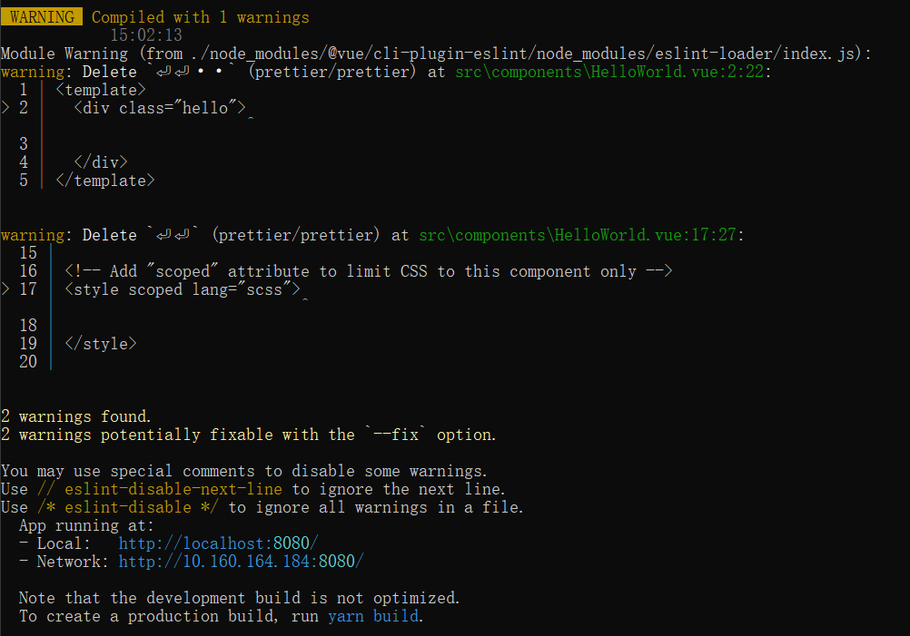

#### 1.去除编译过程的warning

​	 

​	

.eslintrc.js root改为false


#### 2.vue.config.js的配置参数

```javascript
module.exports = {
    devServer:{
        open:true, //编译完成后自动打开浏览器
        port:8080,//端口号
    },
    //打包后的代码点击index.html文件可以直接访问项目
    publicPath:process.env.NODE_ENV === 'production'?'./':'/',
}
```